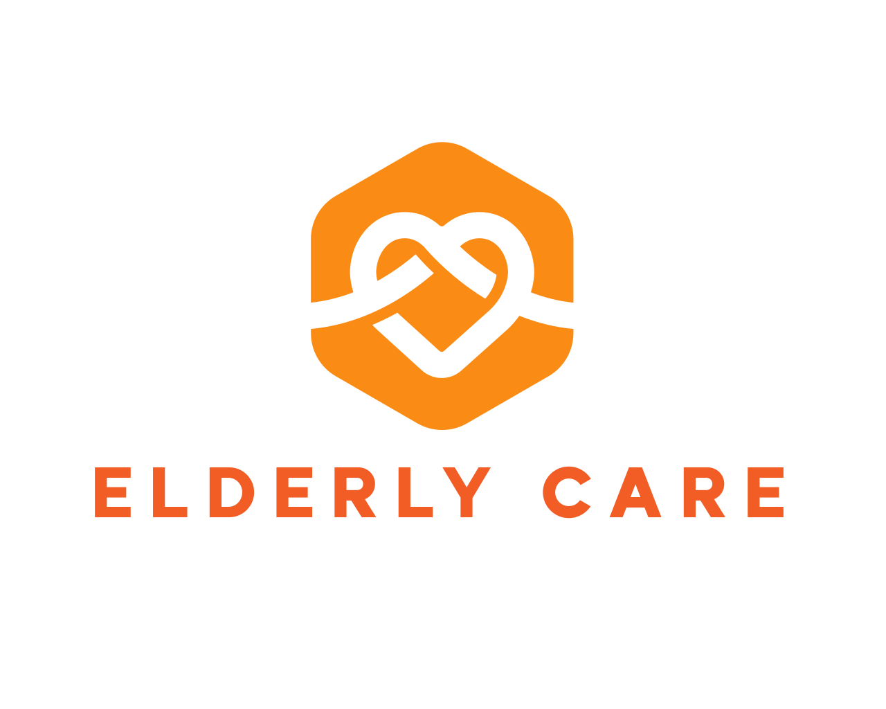

# Elderly Care App

## Target Audience

Elderly individuals living independently, their family members, and caregivers.

## Introduction

Hong Kong's population is rapidly aging. A growing number of seniors choose to, or must, live independently. While technology offers many solutions, the market is fragmented. There are separate apps for video calls, medication reminders, and health tracking, but they are often not elderly-friendly, with complex interfaces and small text. This complexity creates a digital divide, leaving seniors unable to benefit from technological advancements. Furthermore, the lack of integration means critical information does not flow seamlessly to family members who provide care remotely. An all-in-one solution designed with large, simple buttons, voice interaction, and consolidated data is necessary to bridge this gap, promote aging in place, and provide peace of mind to families.

We propose to develop "Elderly Care," a cross-platform application (for iOS, Android, and Web) with a user-centric design featuring large fonts, intuitive icons, and voice-guided navigation.

## Team & Responsibilities

- __Marco, WONG Sai Lung__ (Senior Project Manager & Full-Stack Developer)  
  Project coordination and timeline planning, system architecture/integration, backend development (database & API), and emergency SOS workflow integration.

- __James, LEUNG Tze Shing__ (AI & Mobile Developer — Elderly Section)  
  Elderly app features: AI chat companion, fall detection, elderly-side UI flow (large text/voice-guided), and related use cases/diagrams for the elderly section.

- __Wilson, CHOI Yiu Shing__ (Front-end Developer & UI/UX Designer — Caregiver Section)  
  Caregiver portal/features: caregiver dashboard UI/UX, front-end development (web/app), caregiver-side medication/health monitoring views, and related use cases/diagrams for the caregiver section.

- __Sam, YAU Ming Sum__ (Supervisor)

    Providing technical guidance, ensuring project milestones are met, and assisting with testing and quality assurance.

## General

There is a lack of a simple, integrated, and intuitive application designed specifically for the elderly that addresses their core needs—companionship, medication management, health tracking, and emergency assistance—in a single platform.

### For the Elderly User

- Loneliness and Social Isolation: Many elderly individuals experience loneliness and lack constant companionship, which can impact their mental health.
- Medication Non-Adherence: Difficulty remembering complex medication schedules leads to missed or incorrect doses, posing serious health risks.
- Health Monitoring Difficulties: Manually tracking vital signs is cumbersome, and trends are hard to identify without visualization.
- Fear of Emergencies: The anxiety of falling or having a medical emergency with no way to call for help is a significant concern.

### For Family Members/Caregiver

- Lack of Peace of Mind: Inability to easily check if their elderly relative has taken their medication or is safe.
- Information Silos: Health data and medication logs are often kept on paper or in disparate apps, making it difficult to get a consolidated view of the elderly’s wellbeing.

## Licensing

Elderly Care App is released under the [Apache License](http://www.apache.org/licenses/). Please see the [LICENSE](LICENSE.txt) file for more details.
